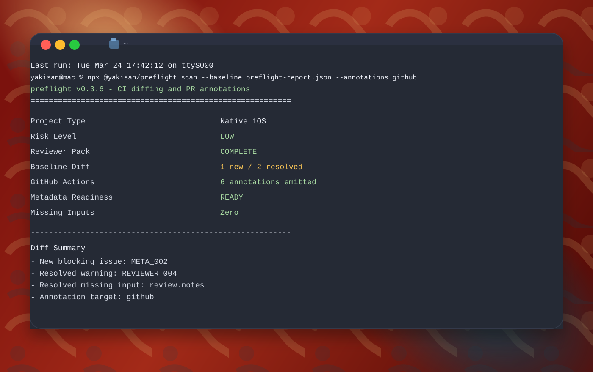

# Preflight

[](https://hypercommit.com/preflight)
[](https://github.com/yunusemreyakisan/preflight/actions/workflows/ci.yml)
[](https://github.com/yunusemreyakisan/preflight/releases)

Preflight is a CLI for detecting App Store submission risk from local iOS project files before a build reaches App Review.

It is built for mobile teams that want deterministic, evidence-backed checks in local workflows and CI. Preflight auto-discovers Apple-side project facts, optionally reads live App Store Connect release data, merges a sparse override config, and reports what was detected, what still needs human input, and what changed since the previous scan.



```bash
npx @yakisan/preflight scan
```

## Overview

- Detect App Store submission risk before uploading a build for review
- Catch missing review-readiness inputs such as demo accounts, login instructions, and review notes
- Inspect privacy, metadata, StoreKit, screenshot, and capability signals from local Apple project files
- Compare local values against App Store Connect metadata, review notes, screenshots, territories, and IAP listings
- Produce human-readable, JSON, baseline-diff, and CI-friendly output

## Quick Start

Preflight requires Node.js 20 or newer and is distributed through npm.

Run a full scan without creating any config first:

```bash
npx @yakisan/preflight scan
```

Or install it globally:

```bash
npm install -g @yakisan/preflight
preflight scan
```

Useful first commands:

- Full scan: `npx @yakisan/preflight scan`
- Machine-readable output: `npx @yakisan/preflight scan --json`
- Compare with a previous report: `npx @yakisan/preflight scan --baseline preflight-report.json`
- Emit GitHub Actions annotations: `npx @yakisan/preflight scan --annotations github`
- Skip App Store Connect calls: `npx @yakisan/preflight scan --skip-app-store-connect`
- CLI version: `npx @yakisan/preflight --version`
- Generate an override template: `npx @yakisan/preflight init`

## What Preflight Checks

Preflight evaluates 30 deterministic rules across:

- Reviewer access and reviewer documentation
- App completeness and release readiness
- Metadata quality and screenshot coverage heuristics
- Privacy signals including tracking usage description and privacy manifest presence
- StoreKit and monetization readiness
- Content and age-rating related declarations
- Optional App Store Connect drift checks across review notes, metadata, screenshots, territories, and IAPs

## Supported Projects and Discovery Sources

Supported project types:

- Native iOS
- Flutter iOS through the `ios/` project
- React Native iOS through the `ios/` project

Discovery still starts from local Apple-side files, but `preflight scan` can also read remote App Store Connect data.

On the first interactive local run, if no App Store Connect credentials are configured, `preflight scan` opens the App Store Connect API Keys page and walks through a guided setup. The saved settings live at `~/.config/preflight/app-store-connect.json` and store `issuerId`, `keyId`, an optional `appId`, and the path to the downloaded `.p8` key.

Environment variables still work and take precedence over the saved local config.

In CI or any non-interactive shell, guided setup does not run. Use the saved local config from a prior local run, or provide `ASC_*` environment variables explicitly.

Current discovery sources include:

- `Info.plist`
- `.xcodeproj/project.pbxproj`
- Entitlements files
- `PrivacyInfo.xcprivacy`
- `.storekit`
- Screenshot folders such as `fastlane/screenshots`

Optional App Store Connect environment variables:

- `ASC_ISSUER_ID`
- `ASC_KEY_ID`
- `ASC_PRIVATE_KEY` or `ASC_PRIVATE_KEY_PATH`
- `ASC_APP_ID` to target a specific app directly instead of resolving by bundle ID

## Commands

Core commands:

| Command | Purpose |
| --- | --- |
| `preflight scan` | Run a full submission risk scan |
| `preflight init` | Create an optional override template |
| `preflight rules` | List bundled rules and metadata |

Key flags:

- `--lang <locale>`: output locale
- `-v, --version`: print the current CLI version
- `--config <path>`: path to an optional override file
- `--json`: machine-readable output
- `--baseline <path>`: compare the current scan against a previous JSON scan report
- `--annotations <target>`: emit workflow annotations, currently `github`
- `--skip-app-store-connect`: disable remote App Store Connect checks for this run
- `--ci`: concise CI output for `scan`
- `--strict`: treat `MEDIUM` risk as blocking for `scan`
- `--plain`: disable branded terminal formatting
- `--update`: include bundled rule metadata for `rules`
- `--force`: overwrite an existing file for `init`

Preflight automatically falls back to plain terminal output when `stdout` is not a TTY or `NO_COLOR=1` is present.

Supported locales:

- `en`
- `tr`
- `de`
- `fr`
- `es`
- `it`
- `pt-BR`
- `ja`
- `ko`
- `zh-CN`

English and Turkish currently have full localized messaging. Other bundled locales fall back to English for untranslated keys.

## Optional Override Config

`preflight scan` discovers what it can from local project files first, then merges `preflight.config.json` only if the file exists.

Use the override config only for review-only inputs and deliberate overrides that cannot be inferred reliably from local files. Empty string placeholders are treated as missing so App Store Connect values can still fill them during `scan`.

Minimal example:

```json
{
  "appCapabilities": {
    "loginRequired": true
  },
  "review": {
    "demoAccountRequired": true,
    "demoAccount": {
      "username": "reviewer@example.com",
      "password": "password123",
      "notes": ""
    },
    "contact": {
      "name": "Release Team",
      "email": "mobile@example.com",
      "phone": ""
    },
    "notes": "Use the demo account to sign in, then open Settings -> Upgrade to review the subscription paywall.",
    "loginInstructions": "Open the app, tap Sign In, use the demo credentials above, then navigate to Settings -> Upgrade.",
    "internetRequired": true
  },
  "privacy": {
    "policyUrl": "https://example.com/privacy",
    "nutritionLabelComplete": true
  }
}
```

## Baseline Diffs and PR Annotations

Store a JSON report from one run, then compare future scans against it:

```bash
npx @yakisan/preflight scan --json > preflight-report.json
npx @yakisan/preflight scan --baseline preflight-report.json
```

For GitHub Actions or pull request workflows, emit annotations directly into the job log:

```bash
npx @yakisan/preflight scan --annotations github
```

## CI Example

Use Preflight as a gate in CI:

```yaml
- name: Preflight Scan
  run: npx @yakisan/preflight scan --ci --annotations github --json > preflight-report.json
```

Scan output includes `risk_level`, `risk_score`, `blocking_issues`, `warnings`, discovery evidence, `missing_inputs`, `review_readiness`, and `app_store_connect`.

## Exit Codes

- `0`: low risk
- `1`: medium risk or non-blocking warning
- `2`: high risk or blocked release

With `preflight scan --strict`, `MEDIUM` risk also exits with `2`.

Licensed under the [MIT License](LICENSE).
